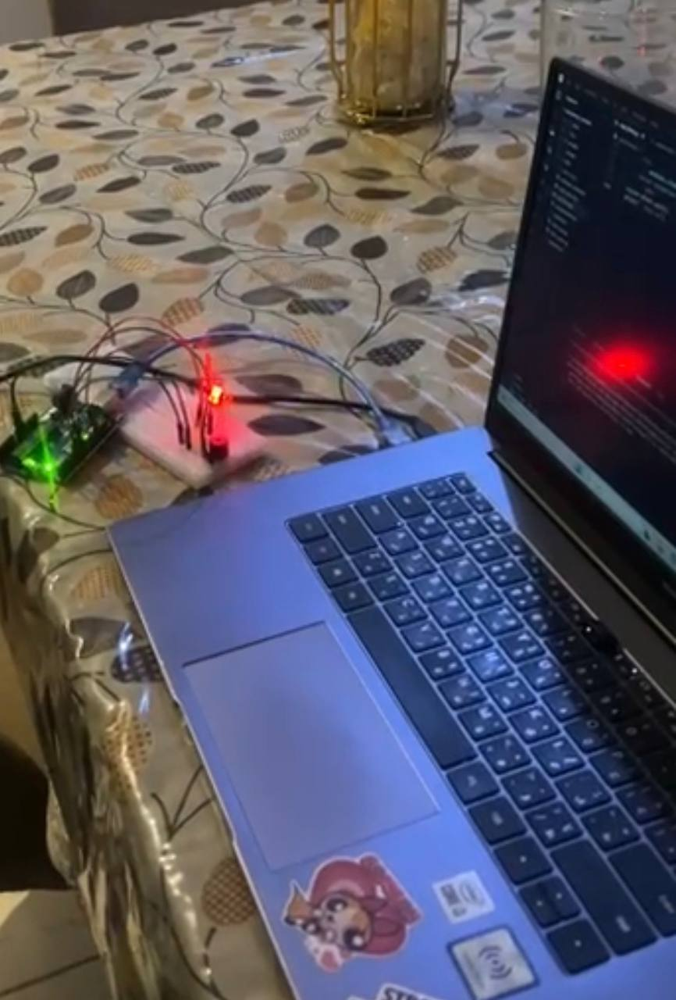
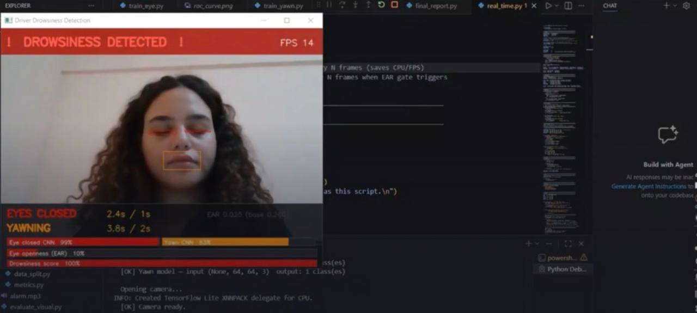
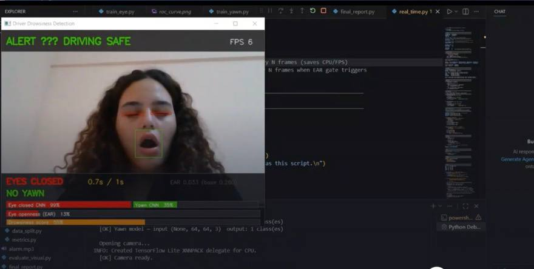
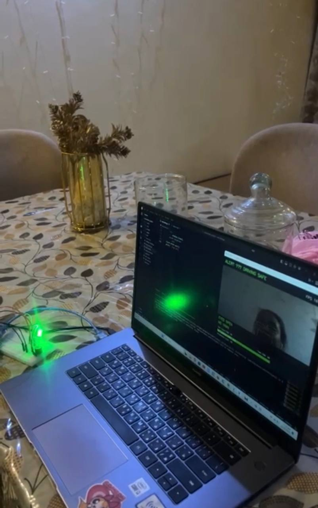

# Driver Drowsiness Detection System

## Graduation Project II
Faculty of Engineering Technology  
El-Sewedy University of Technology

---

## Project Overview

Driver drowsiness is one of the leading causes of road accidents worldwide. This project presents an intelligent Driver Drowsiness Detection System that uses Artificial Intelligence and Computer Vision techniques to monitor drivers in real time and detect signs of fatigue before accidents occur.

The system analyzes facial landmarks, eye closure duration, yawning frequency, and head movement patterns. When drowsiness is detected, an alarm is triggered and an Arduino-based warning system is activated to alert the driver.

---

## Features

- Real-Time Face Detection
- Eye Closure Detection using EAR (Eye Aspect Ratio)
- Yawning Detection using MAR (Mouth Aspect Ratio)
- Facial Landmark Tracking using MediaPipe
- Drowsiness Alert System
- Arduino Integration
- Real-Time Monitoring
- Visual and Audio Warning System

---

## System Architecture

```text
Camera Input
     │
     ▼
Face Detection
     │
     ▼
Facial Landmark Extraction
     │
     ▼
EAR & MAR Calculation
     │
     ▼
Drowsiness Analysis
     │
     ▼
Alert Generation
     │
     ▼
Arduino Warning System
```

---

## Technologies Used

- Python
- OpenCV
- MediaPipe
- TensorFlow
- Keras
- MobileNetV2
- YOLOv8
- Arduino Uno
- NumPy
- Scikit-Learn
- Pygame

---

## Project Structure

```text
drowsiness_project/
│
├── data/
├── models/
├── results/
├── utils/
│
├── train_eye.py
├── train_yawn.py
├── real_time.py
├── evaluate_visual.py
├── final_report.py
├── requirements.txt
├── alarm.mp3
└── yolov8n.pt
```

---

## Installation

```bash
pip install -r requirements.txt
```

---

## Usage

```bash
python real_time.py
```

---

## Project Screenshots

### Hardware Integration



The system is connected to an Arduino Uno board that activates warning indicators and alarm signals when drowsiness is detected.

---

### Drowsiness Detection



The system detects prolonged eye closure and excessive yawning and immediately triggers a drowsiness warning.

---

### Yawning Detection



The Mouth Aspect Ratio (MAR) is continuously monitored to identify yawning events in real time.

---

### Safe Driving State



When the driver is alert and attentive, the system displays a safe-driving status and activates the green indicator.

---

## Results

| Metric | Result |
|----------|----------|
| Eye Model Accuracy | 95.68% |
| Yawn Model Accuracy | 92.72% |
| Overall System Accuracy | 92.80% |
| Real-Time Processing | Up to 30 FPS |

---

## Future Work

- Night Vision Support
- Driver Distraction Detection
- Mobile Application Integration
- Cloud Monitoring System
- Fleet Management Integration
- Embedded System Deployment

---

## Team Members

- Abdelhakim Nabil Abdelhakim
- Ahmed Alham Mahmoud
- Ahd Malik Monair
- Magy Romani Ezzat
- Mariam Magdy Mohammed
- Abla Abdelmoneim

---

## Supervisor

Dr. Sahar Kamal

---

## Academic Year

2025 / 2026